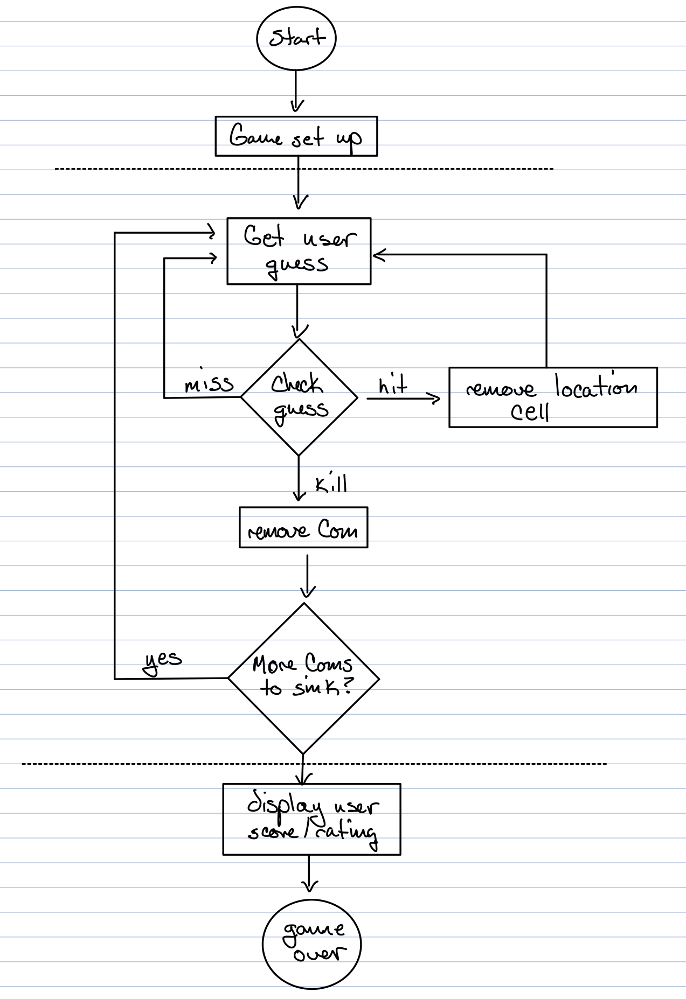

#Battle Com

This is a Battleship-style game.

**Goal:**
Sink all of the computer's ships in the fewest number of guesses. You will be given a rating level based on how well you
perform.

**Setup:**
When the game program is launched, the computer places three ships on a 7 x 7 grid. When that is done the game will ask 
you for the first guess.

**How you play:**
This version works at the command-line. The program will prompt you to enter a guess (a cell), that you'll type at the 
command-line as "A1", "C5", etc. The result will be returned as "Hit", "Miss", or "You sunk my Com!".  When you have 
sunk all of the Coms, the game will print your rating to the console.

## High Level Design

1. User starts the game
    - From the game setup action, the game creates three Coms and places them on a virtual grid.
2. Game play begins by repeating the following steps until all Coms have been sunk.
    - Prompt the user for a guess ("A1", "D2", etc.)
    -Check the user guess against all Coms to look for a hit, miss or kill. Take appropriate action: if a hit, delete
      cell. If kill, delete Com.
3. Game Over
    - Give the user a rating based on the number of guesses.

Enjoy!!